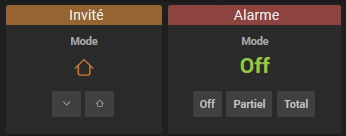

# Jeedom v4 | Astuces pour la personnalisation de l'interface

Plusieurs choses sont paramétrables nativement dans ***Réglages / Système / Configuration, Interface***



Référez vous à la documentation, ou aux points d'interrogations sur chaque paramètre.

Vous pouvez, en cliquant sur le bouton 'Personnalisation avancée', paramétrer vos propres fonctions javascripts et/ou règles css, pour le desktop ou la webapp (mobile). Vous pouvez également y accéder directement par le menu, ***Réglages / Système / Personnalisation avancée***

#### Introduction
Jeedom est nativement paramétrable, mais propose aussi d'inclure des ***Personnalisation avancée***.
Vous pouvez ainsi paramétrer vos propres fonctions javascripts et/ou règles css, pour le desktop ou la webapp (mobile).
Pour y accéder : ***Réglages / Système / Personnalisation avancée***

Concernant les règles css, vous aurez probablement besoin de connaitre les bons sélecteurs (sur quels éléments s'appliquent les règles css définies). Pour cela, quasiment tous les navigateurs proposent des *Outils de développement*, généralement accessibles par Ctrl+Shift+I (ou par le menu bien sûr).

Voici un exemple dans Firefox. En cliquant sur l'icône en haut à gauche, puis en pointant le curseur sur l'élément de la page que vous souhaitez, vous accédez directement à son code html, où vous pouvez voir ses classes css, id, sa structure, etc.



### Image de fond générale

Si vous souhaitez appliquer une image de fond aux différentes pages de Jeedom, et non pas à un objet:
- Installez le plugin [JeeXplorer](https://www.jeedom.com/market/index.php?v=d&p=market&type=plugin&&name=jeexplorer)
- Copiez votre image dans /data/img/monimage.jpg
- Dans ***Personnalisation avancée***, css desktop et/ou mobile:
Ajoutez cette règle:
```css
.backgroundforJeedom {
  background-image: url("/data/img/monimage.jpg") !important;
  background-size: 100% 100% !important;
  background-repeat: repeat;
  position: absolute;
  top:0;
  left:0;
  width:100%;
  height:100%;
  opacity:.35;
  z-index:-1;
}
```
Ajustez les paramètres comme bon vous semble, le nom de l'image bien sûr mais aussi éventuellement sa taille (100% ou en px) et sa transparence (opacity).
Si vous utilisez cette règle, autant cocher dans ***Réglages / Système / Configuration, Interface*** l'option ***Masquer les images de fond***.



### Plugin Mode coloré

Si vous souhaitez ne pas avoir toutes les icônes de l'interface colorées, il vous suffit de décocher l'option 'icônes widgets colorées' dans les réglages.
Avec ce paramètre, aucun widget, ni objet, ni plugin n'aura d'icône colorée.
Si toutefois vous souhaitez disposer quand même des modes colorés du plugin Mode, voici ce qu'il suffit d'ajouter en ***Personnalisation avancée***, css desktop et/ou mobile:

```css
[data-eqtype="mode"] .icon_blue { color: var(--al-info-color) !important; }
[data-eqtype="mode"] .icon_green { color: var(--bt-success-color) !important; }
[data-eqtype="mode"] .icon_orange { color: var(--al-warning-color) !important; }
[data-eqtype="mode"] .icon_red { color: var(--al-danger-color) !important; }
[data-eqtype="mode"] .icon_yellow { color: var(--lb-yellow-color) !important; }
```
Vous pouvez adapter ce code à n'importe quel plugin supportant les icônes colorées en modifiant le sélecteur ```[data-eqtype="mode"]``` (voir introduction ci dessus).

### Changer certaines couleurs de l'interface
La v4 de Jeedom est une réécriture complète de son design et de la façon dont il est appliqué. Les versions précédentes s'appuyaient énormément sur du code css sur les éléments (*inline style*), alors que la v4 possède un système de design et de thème global, plus efficace (et moderne). Ce système s'appuie notamment sur l'utilisation de variables css, utilisées par les différents thèmes pour changer les couleurs. Ce qui va nous permettre de jouer aussi sur ces couleurs, toujours dans la partie css des ***Personnalisation avancée***

##### Les couleurs de catégories d'équipement
Voici les couleurs de catégories de la v3. Ce n'est qu'un exemple, puisque bien sûr les couleurs de catégories des thèmes Light et Dark sont différentes, pour s'intégrer au mieux à chaque thème dans son ensemble.
```css
:root {
  --cat-security-color: 155, 75, 70;
  --cat-heating-color: 46, 141, 205;
  --cat-automatism-color: 128, 128, 128;
  --cat-light-color: 243, 156, 18;
  --cat-multimedia-color: 52, 73, 94;
  --cat-energy-color: 46, 176, 75;
  --cat-other-color: 25, 188, 156;
  --cat-scenario-color: 127, 140, 141;
}
```
##### Les couleurs de blocs de scénarios
Avec la v4, les couleurs des blocs de scénarios ne sont plus attribuées aléatoirement mais par type de bloc. La correspondances avec la v3 n'est donc pas possible, et je suis plus pour s'adapter que pour l'immobilisme dans le passé, mais voici par exemple celle du thème v4 Dark.

> Vous verrez dans les exemples suivant que les couleurs sont parfois
> définies en rgb(x,x,x) ou directement en x,x,x. Veuillez à respecter
> le format original.

```css
:root {
  --scBlocIF: rgb(88,89,90);
  --scBlocACTION: rgb(154,152,152);
  --scBlocIN: rgb(75,128,62);
  --scBlocAT: rgb(58,86,128);
  --scBlocFOR: rgb(152,126,22);
  --scBlocCODE: rgb(50,62,85);
  --scBlocCOM: rgb(65,95,115);

  --scBlocIF-sep:rgb(56, 56, 56);
  --scBlocACTION-sep: rgb(96,93,90);
  --scBlocIN-sep: rgb(45, 77, 37);
  --scBlocAT-sep: rgb(35, 52, 83);
  --scBlocFOR-sep: rgb(91, 76, 13);
}
```
##### Autre exemples

- Changement du background des tuiles sur le *dashboard* (ici couleur v4 thème dark) :
```css
:root {
  --eq-bg-color: 38, 38, 38;
}
```
- Changement du background des pages (ici couleur v4 thème dark) :
```css
:root {
  --bg-color: 25, 25, 25;
}
```
- Changement des couleurs de texte et de lien (ici couleur v4 thème dark) :
```css
:root {
  --linkHover-color: rgb(228, 228, 228);
  --linkHoverLight-color: rgb(230, 230, 230);
}
```

etc.

Vous pouvez jeter un œil au fichier css du core comportant, pour chaque thème, les variables définies :
[colors.css thème Dark](https://github.com/jeedom/core/blob/alpha/core/themes/core2019_Dark/desktop/colors.css)
