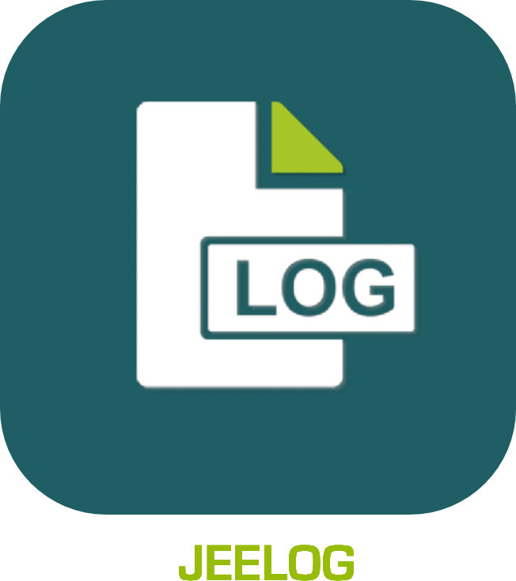

# JeeLog - Plugin pour Jeedom

Plugin de journalisation d'activité.

Après avoir renseigné les commandes info et scénarios souhaités, vous disposez d’un journal sur le Dashboard/Vue/Design.

Vous visualisez ainsi, rapidement, ce qu’il c’est passé sur votre Jeedom ces dernières heures: ouverture de porte/volet, allumage de lumière, présence, changement de mode, exécution de scénarios avec leurs actions, etc.

[Changelog](changelog.md) 

## Configuration du plugin JeeLog

Après installation du plugin, il vous suffit de l’activer.
Il apparaitra alors dans le menu *Plugins > Monitoring*

## Ajouter un journal
Cliquez simplement sur *Ajouter*, puis nommez votre équipement.



Vous pouvez également paramétrer:
- Un cron d’auto-actualisation.
- Afficher Mise à jour : Ajoute une ligne en haut du log avec l'heure de mise à jour.
- Détails des scénarios : Affiche, en plus du déclenchement du scénario, les actions lancées par celui-ci.
- Le nombre d'heures à afficher. Par défaut, le log affichera l'activité sur les 8 dernières heures.
- Le format de date en début de chaque ligne du log (au format php):
    - [Doc php](http://php.net/manual/fr/function.date.php)
    - Si vous voulez seulement l'heure en début de ligne de log : H:i:s
    - Pour seulement jour-mois heure : d-m H:i:s
- Les hauteur/largeur des tuiles Dashboard et Vue. Ce qui permet d'avoir une tuile plus grande sur une vue, afin de ne pas prendre trop de place sur le Dashboard.
- Les couleurs de fond et de texte au format css pour la tuile Design. Par ex, pour un fond transparent, indiquez rgba(0,0,0,0) !

### Onglet *Logs*

Une fois l'équipement créé, allez sur l'onglet *Logs* pour paramétrer ce que le journal va afficher.

C'est ici que vous allez ajouter les commandes info et les scénarios que vous souhaitez.

Vous retrouvez donc:
- Import infos : Ouvre une fenêtre listant toutes vos commandes infos avec option de recherche, pour en importer plusieurs à la volée.
- Une option pour activer ou non cette info/scénario.
- L'info/scénario à afficher.
- Le nom sous lequel cela apparaitra dans le journal.
- Pour les commandes info:
  - Le type d'info (Eteint/Allumé, Fermeture/Ouverture, Presence, Valeur). Pour des volets, ou le plugin Mode, utilisez Valeur.
  - Une option pour inverser ce type.
  - Une option pour ne pas répéter la valeur dans le journal si elle ne change pas.

Vous pouvez monter/descendre les éléments de cette liste pour plus de clarté (drag/drop).

- Pour que ces commandes apparaissent dans votre journal, il faut qu'elles soient historisées sur la période. De la même manière que pour les voir dans *Analyse > Historique*.
- L'affichage des scénarios se fait par le log de chaque scénario demandé. Si le log est vidé, il n'apparaitra plus.



Vous pouvez également afficher un fichier log de Jeedom.



Cliquez sur *Ajouter Log*, une élément log apparait alors avec la liste des fichiers log de Jeedom présents. Ce sont les logs de Jeedom dans /html/log.

>Si vous ajoutez un fichier de log, toutes les autre commandes et scenarios seront supprimés du journal quand vous sauvegarderez celui-ci. En effet, le fonctionnement n'est pas le même, puisque dans ce cas il n'y a pas d'évènement triés par date etc., mais simplement le continu du fichier. Il n'est donc pas possible de mixer des commandes ou scénarios avec des fichiers de log dans le même équipement jeeLog.

Créer un équipement jeeLog avec un fichier de log permet d'afficher ce fichier sur une *vue*, un *design*, et donc aussi dans l'app mobile (avec un *design*) ou la version mobile du dashboard.

## Affichage

>App Mobile: Si vous souhaitez afficher un journal dans l'app mobile, créez un *design* au bon format, ajoutez l'équipement JeeLog sur toute la surface. Vous pouvez également ajouter un bouton avec la commande Rafraichir, si l’icône rafraichir est trop petite. Vous aurez ainsi accès au log/journal en plein écran directement dans l'app mobile.

Voici quelques illustrations du résultat, avec les paramètres par défaut.

Dashboard:



Vue:



Vue sur mobile:



## Changelog

[Voir la page dédiée](changelog.md).

